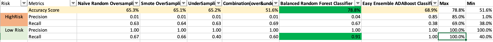

## Credit Risk Analysis

#### Purpose

- The purpose of this analysis is to see the metrics behind different alogrithms used to predict credit card risk.
-  The models include the following;

Naïve Random Oversampling	
Smote OverSampling	
UnderSampling
Combination(over&under)
Balanced Random Forest Classifier	 
Easy Ensemble ADABoost Classifier

### Summary

- The results from each model are displayed below. 
 

- Per the data, Balanced Random Forest Classifier is the most accurate based on the accuracy score of 78.8% and the recall factor .91. 